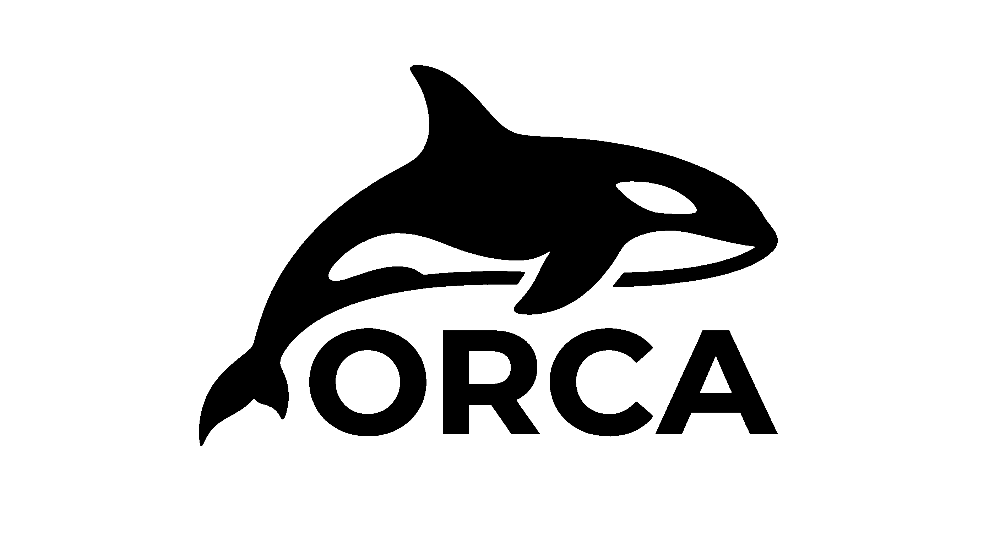
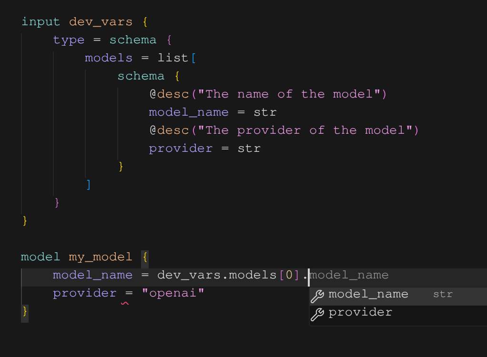
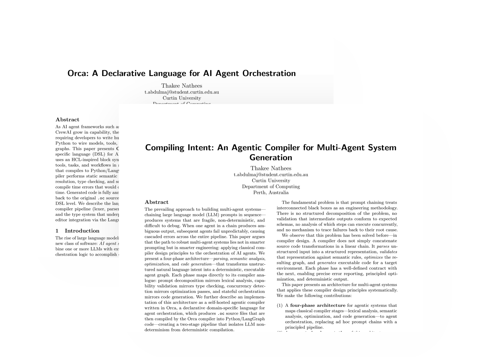

<p align="center">
  
</p>

<p align="center">
  <strong>A declarative language for AI agent orchestration.</strong><br>
  A research agents-as-a-code language for expressing agentic systems as declarative programs
</p>

<p align="center">
  <a href="#why-orca">Why Orca</a> &middot;
  <a href="#quick-start">Quick Start</a> &middot;
  <a href="#how-it-works">How It Works</a> &middot;
  <a href="#contributing">Contributing</a>
</p>

<p align="center">
  
  
  

</p>

---

## Why Orca?

Frameworks like LangGraph, AutoGen, and CrewAI provide the primitives for building AI agent systems, but they require you to express agent configurations, tool bindings, and execution graphs in imperative Python code. A simple two-agent pipeline can easily span 100+ lines — importing modules, defining state schemas, instantiating models, writing node functions, wiring a graph, and compiling it.

Orca is a domain-specific language that lets you **declare** what your agent system looks like, and a compiler handles the rest. Think [Terraform](https://www.terraform.io/) for AI agents — an HCL-inspired block syntax where you describe *what* exists, not *how* to wire it.

<table>
<tr>
<td width="45%" valign="top">

**Orca**

```hcl
model claude {
  provider    = "anthropic"
  model_name  = "claude-opus-4.6"
  temperature = 0.3
}

agent researcher {
  model   = claude
  tools   = [builtins.web_search]
  persona = "You're a tech trends researcher"
}

agent writer {
  model   = claude
  persona = "You're a professional writer"
}

workflow search_and_write {
  researcher -> writer
}

cron daily {
  schedule = "0 9 * * 1-5"
  run      = search_and_write
}
```

</td>
<td width="55%" valign="top">

**Python**

```python
from langchain_anthropic import ChatAnthropic
from langchain_community.tools import TavilySearchResults
from langgraph.graph import StateGraph, MessagesState

claude = ChatAnthropic(
    model="claude-sonnet-4-20250514",
    temperature=0.3,
)

search_tool = TavilySearchResults()
claude_with_tools = claude.bind_tools([search_tool])

def researcher(state: MessagesState):
    sys = "Research topics thoroughly."
    messages = [SystemMessage(content=sys)]
        + state["messages"]
    return {"messages":
        [claude_with_tools.invoke(messages)]}

def writer(state: MessagesState):
    sys = "Write reports from research."
    messages = [SystemMessage(content=sys)]
        + state["messages"]
    return {"messages":
        [claude.invoke(messages)]}

graph = StateGraph(MessagesState)
graph.add_node("researcher", researcher)
graph.add_node("writer", writer)
graph.add_edge("__start__", "researcher")
graph.add_edge("researcher", "writer")
graph.add_edge("writer", "__end__")
app = graph.compile()

# Cron trigger? You're on your own.
```

</td>
</tr>
</table>

## Orca Studio


**Orca Studio** is an in-browser companion to the text-based language: a [Next.js](https://nextjs.org/) app that lays out Orca concepts — models, agents, tools, tasks, workflows, and the edges between them — on an interactive canvas.

Try it online: [Orca Studio (GitHub Pages)](https://thakeenathees.github.io/orca/studio/).

To run Studio locally:

```
cd studio
pnpm install
pnpm run dev
```


<!--  -->


<!--  -->

### Design Principles

**Declarative over imperative.** You describe the components of an agent system and their relationships. The compiler handles the code generation. No state schemas, no graph wiring, no boilerplate.

**Convention over configuration** Sensible defaults for everything. A model block with just a provider should work. Only override what you need to customize.

**Composability** Agents, tools, models, and workflows are independent blocks that compose freely. Build complex systems by combining simple, self-contained pieces.

**Highly orthogonal syntax.** The basic construct of orca is declarative blocks with parameters as key-value assignments with predictable syntax.

**Language/Framework independent.** Orca is not a wrapper around LangGraph. It's a language with its own compiler, type system, and semantic analysis. The current backend targets LangGraph, but the architecture is designed for multiple backends (CrewAI, AutoGen, and others).


## Quick Start

```bash
git clone https://github.com/ThakeeNathees/orca.git
cd orca/compiler
make build
```

Create a file called `main.oc`:

```hcl
model gpt4 {
  provider    = "openai"
  model_name  = "gpt-4o"
  temperature = 0.7
}

agent assistant {
  model  = gpt4
  persona = "You are a helpful assistant."
}
```

Compile it:

```bash
orca build
```

This reads all `.oc` files in the current directory and generates a `build/` directory with runnable Python and LangGraph code.

## How It Works

```
.oc source → Lexer → Parser → Analyzer → Code Generator → Python
```

The Orca compiler is written in Go with a four-stage pipeline.

The **lexer** tokenizes `.oc` source files with full line and column tracking. The **parser** is a [Pratt parser](https://matklad.github.io/2020/04/13/simple-but-powerful-pratt-parsing.html) that produces a typed AST from the token stream, with error-tolerant parsing that can recover and report multiple diagnostics in a single pass. The **analyzer** performs semantic analysis — resolving references between blocks (an agent referencing a model, a workflow referencing agents), type checking assignments against block schemas, and validating required fields. The **code generator** walks the analyzed AST and emits Python targeting the LangGraph framework, with source-map comments on every line tracing back to the original `.oc` source.

The code generator is behind a `Backend` interface. Adding a new target (CrewAI, AutoGen, or a different language entirely) means implementing that interface — the rest of the pipeline stays unchanged.

Every block type in the language — `model`, `agent`, `tool`, `task`, `workflow`, `webhook` — is defined by a **schema** that specifies its fields, types, and constraints. The analyzer validates `.oc` files against these schemas at compile time, catching errors that frameworks would only surface at runtime.

## Editor Support

Orca ships with a VS Code extension that provides syntax highlighting, autocomplete, and go-to-definition for `.oc` files.

To install the Orca language extension locally for your editor, simply run the commands below. This will link the extension directory directly, enabling you to get the latest features without needing a marketplace install. For VS Code, use:

```bash
ln -s $(pwd)/editor/vscode ~/.vscode/extensions/orca-lang
```

If you're using Cursor, the process is just as straightforward. Run:

```bash
ln -s $(pwd)/editor/vscode ~/.cursor/extensions/orca-lang
```

After creating the symlink for your editor of choice, restart the editor to activate the extension.




## Contributing

Test Driven Development is enforced throughout the project: every new feature or change starts with a failing test case. See [CLAUDE.md](CLAUDE.md) for development conventions and detailed project structure.

## Papers

Orca is accompanied by two research papers exploring declarative agent orchestration and intent compilation. Both are work-in-progress and live in the [`paper/`](paper/) directory.

<p align="center">
  
</p>

To build a paper’s PDF (LaTeX required), run `make build` from that paper’s folder. The PDF is written to `out/main.pdf`.

```bash
cd paper/agents-as-code && make build
cd paper/compiling-intent && make build
```

### Paper 1: [Orca: A Declarative Language for AI Agent Orchestration](paper/agents-as-code/)

Presents Orca as a domain-specific language for AI agent orchestration. Describes the HCL-inspired block syntax, the four-stage compiler pipeline (lexer, Pratt parser, semantic analyzer, code generator), and the type system that enables static checking and editor integration via the Language Server Protocol. The compiler catches misconfigurations — undefined references, type mismatches, missing fields — at compile time, before any LLM is invoked.

### Paper 2: [Compiling Intent: An Agentic Compiler for Multi-Agent System Generation](paper/compiling-intent/)

Argues that the path to robust multi-agent systems is not smarter prompting but smarter engineering. Applies classical compiler design principles — parsing, semantic analysis, optimization, and code generation — to the problem of transforming natural language intent into executable agent graphs. The agentic compiler, itself written in Orca, takes natural language descriptions and generates valid `.oc` source files, which are then compiled by the Orca compiler into Python/LangGraph code — creating a two-stage pipeline that isolates LLM non-determinism from deterministic compilation.

### References

- Jason Mars et al. (2024) *Jaseci: Programming the Future of AI* [online] Available at https://github.com/jaseci-labs/jaseci

- Harrison Chase et al. (2025) *LangGraph: Multi-Actor Programs with LLMs* [online] Available at https://github.com/langchain-ai/langgraph

- Sirui Hong et al. (2023) *MetaGPT: Meta Programming for A Multi-Agent Collaborative Framework* [online] Available at https://arxiv.org/abs/2308.00352

- Omar Khattab et al. (2023) *DSPy: Compiling Declarative Language Model Calls into Self-Improving Pipelines* [online] Available at https://arxiv.org/abs/2310.03714

- Dawei Gao et al. (2024) *AgentScope: A Flexible yet Robust Multi-Agent Platform* [online] Available at https://arxiv.org/abs/2402.14034

- Mitchell Hashimoto et al. (2014) *HCL: HashiCorp Configuration Language* [online] Available at https://github.com/hashicorp/hcl

- Jieyuan Wu et al. (2023) *AutoGen: Enabling Next-Gen LLM Applications via Multi-Agent Conversation* [online] Available at https://arxiv.org/abs/2308.08155

- João Moura. (2024) *CrewAI: Framework for Orchestrating Role-Playing AI Agents* [online] Available at https://github.com/crewAIInc/crewAI

- Alexey Kladov. (2020) *Simple but Powerful Pratt Parsing* [online] Available at https://matklad.github.io/2020/04/13/simple-but-powerful-pratt-parsing.html

## License

[MIT](LICENSE)
